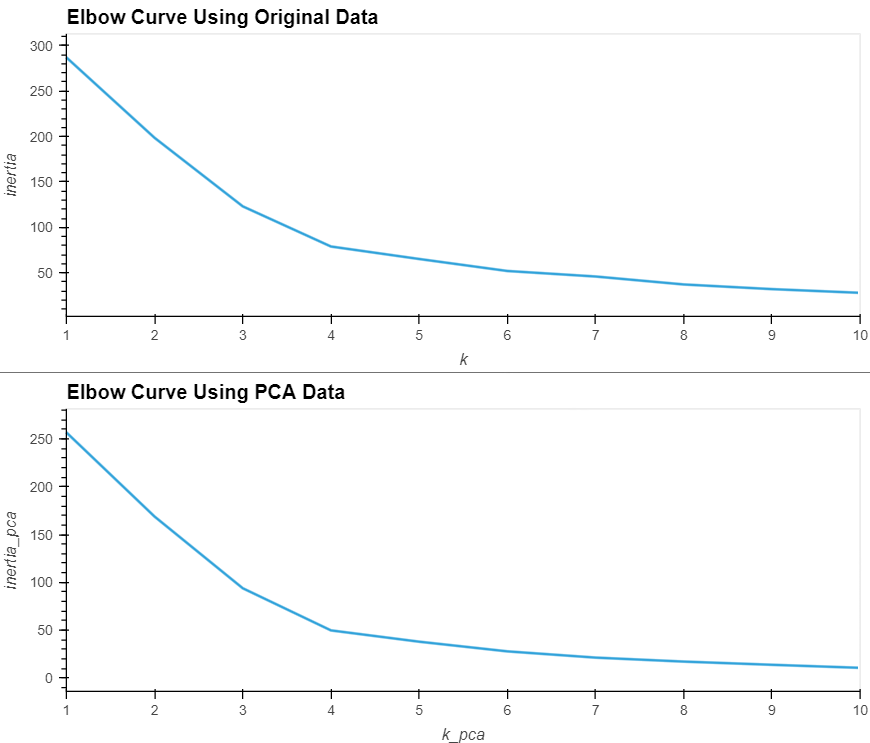

# Module 19 Challenge, 31 October 2023, Unsupervised Machine Learning

Development on this project has stopped.

## Table of Contents

- [Description](#description)
- [Usage](#usage)
- [Gallery](#gallery)
- [References](#references)
- [Acknowledgements](#acknowledgements)
- [Author](#author)

## Description

Evalutes the trade-offs in using unsupervised machine learning models to group cryptocurrencies for hypothetical investment portfolio recommendations. It uses first the original data, then an optimized version using principal component analysis. The elbow method is used to determine the best value of `k` (four in both cases) for the K-Means algorithm, and scatter plots display the resulting clusters.

The principal component analysis clusters the data more compactly, as evidenced by the lower inertia, and supplys more visually useful results for interpretation (see [Gallery](#gallery) below).

## Usage

Run the `Crypto_Clustering.ipynb`, located in the root of this repo. It displays all steps of data collection, preparation, and analysis.

## Gallery

Elbow plot:

Scatter plot comparison:

## References

Dataset provided by edX Boot Camps, LLC

## Acknowledgements

Thanks to Geronimo Perez for feedback and assistance

## Author
Bryan Johns, October, 2023
